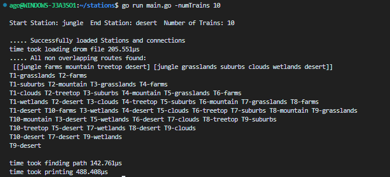

# This program is still works in progress.

the program works with small maps. just not very well optimized

- there is a logic fault in finding the shortest path.(with bigger number of stations it starts looping)
- the mapping logic only prefers shortest path first(it does not count if it can choose two bit longer ones to get there with less steps)
- Optimisation: Reading and Printing could be done async to increase performance. also want to look over hash maps. can be optimized there as well.
- errors need to be reorganized(right now they are just near the functions, it makes more readable if we string them as a error package)
- a lot of small improvements to make the code more readable.

# Railway Station Routing Program Documentation

Welcome to the Railway Station Routing Program! This program is designed to process a network of railway stations and find the optimal routes for a given number of trains from a starting station to a destination station. Below is the documentation outlining the structure and functionality of the program.

## Overview

The program is divided into three main packages:

1. `inOut`: Handles input/output operations, including reading station and connection data from a file and printing out the train routes.
2. `logic`: Contains the logic to find all possible routes from the start station to the end station using a depth-first search algorithm.
3. `printing`: handles the printing of steps that trains have to tak. Plus makes everything readable.

## Main Program

The entry point of the program is the `main` function, which processes command-line arguments and orchestrates the execution of the program.

### Command-Line Arguments

The program accepts the following arguments:

- `networkMap`: Path to the network map file (default: `test.txt`)
- `start`: Name of the starting station (default: `jungle`)
- `end`: Name of the ending station (default: `desert`)
- `numTrains`: Number of trains to route (default: `1`)

### Execution Flow

1. Parse the command-line arguments.
2. Validate the number of trains and station names.
3. Read the station and connection data from the specified file.
4. Find all routes from the start station to the end station.
5. Print out the train routes and timing information.

## Package `inOut`

### Function `FillStruct`

Reads the network map from a file and populates the `mainStations` map with `structs.Station` objects.

#### Station struct

	Name string
	X           int
	Y           int
	Vistited    bool
	Connections []*Station

#### Parameters

- `filePath`: Path to the network map file.
- `start`: Name of the starting station.
- `end`: Name of the ending station.

#### Returns

A map of station names to `structs.Station`.

### Function `makeStation`

Parses a line from the stations section of the network map file and creates a `structs.Station` object.

#### Returns

A `structs.Station` object.

### Function `addConnection`

Parses a line from the connections section of the network map file and updates the `mainStations` map with the connections between stations.

### Function `ignoreHash`

Helper function to remove comments from a line of text.

#### Returns

The processed string without comments.

## Package `logic`

### Function `FindAllRoutes`

Finds all possible routes from the start station to the end station using depth first search logic.

#### Parameters

- `mainMap`: Map of station names to `structs.Station` pointers.
- `start`: Name of the starting station.
- `end`: Name of the ending station.

#### Returns

A slice of slices containing the names of the stations in each route.

### Function `removeAndOrder`

Removes overlapping routes and orders the remaining routes by length.

#### Parameters

- `matrix`: A slice of slices containing the station names in each route.

#### Returns

A sorted slice of slices with unique routes.

## Package `inOut`

### Function `Printout`

Prints out the train routes based on the shortest routes found.

#### Parameters

- `tracks`: A slice of slices containing the station names in each route.
- `numTrains`: The number of trains to route.

### Function `nicePrint`

Helper function for `Printout` to sort and print the train routes.

### Function `addStrList`

Adds strings representing train routes to a list and updates the train map.

---

## Example of use
